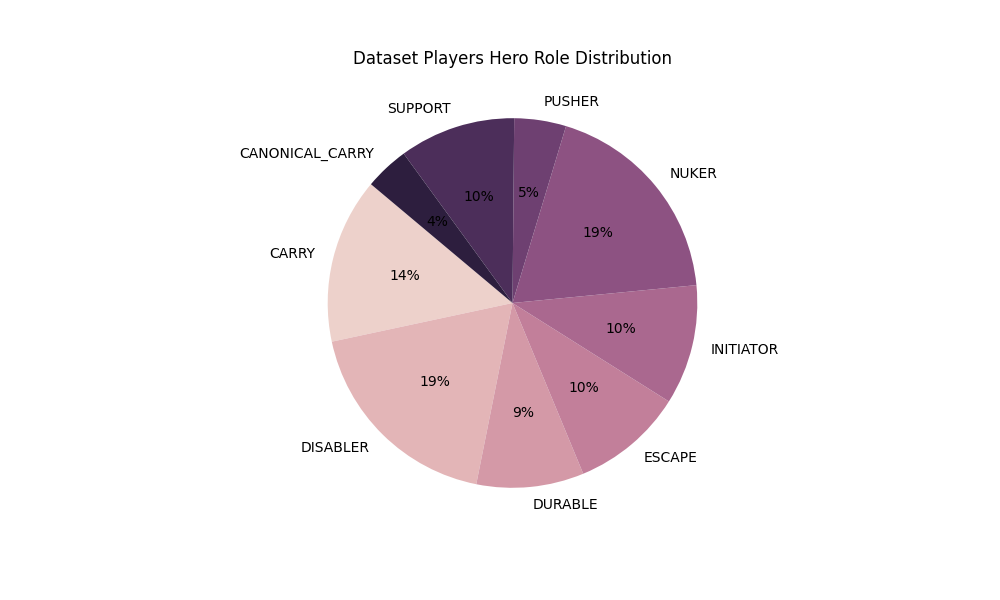

<div align="center">

<h1>mmr-predictor</h1>

     

<h4>Fun side project to develop a web-tool to predict a player's MMR from game statistics :video_game:</h4>
</div>

## About
### Did you know?
Dota 2 (Defence of the Ancients 2) is a multiplayer online battle arena video game, where two teams of five players each try to destroy their opponents "Ancient". During the game, each player controls a "hero", each with a different ability set and role.

Each player has a "rank" that is used by the game to match them and form balanced teams for each game. The only way to increase ones rank is to _win_ more games than to lose. On average, a match takes 25 min, with up to 82 min in total.

### Our objective
:point_right: It is the aim of this project to create a predictive model by analysing large number of Dota 2 games that can accurately predict a player's rank, given how they have performed in a given game.

We've started by collecting data from the publicly available [OpenDota API](https://docs.opendota.com/) and covered some initial data analysis you can find in the notebooks. We're currently exploring machine learning models suited for the data available.

In the long run, we intend to create a web-tool to let Dota players see their predicted game performance (MMR) using our models. As a start, we utilized docker to organise our data collection pipeline so that it uses MongoDB as a persistence layer.

## Getting started
### Exploring the project
The repository mainly consists of two parts: Firstly, we have streamlined the collection and processing of match data (see below). On the other hand, you can gain insights into our previous match data analyses in the various Jupyter notebooks.

```
├── README.md
├── eda-notebooks   <-- Preliminary data exploration notebooks
├── resources       <-- data and plots
└── src             <-- data collection and preprocessing pipeline
```

### Collecting match data
To collect and parse MMR data from the OpenDota API, run collection script, e.g.

`python3 collect_data_auto.py --output_dir './resources/data' --wait_time 900`

which will call the API every 15 minutes, due to connection restrictions. The data used in the project so far is _not_ included in this repository, so you need to collect the data for yourself!

## Development
### Updates
For the latest changes, see `CHANGELOG.md`

### Setup
This project requires Python 3.11+ as well as packages which you can find in `requirements.txt`. You can install them using PIP

`pip install -r requirements.txt`

We are using a docker-compose backend to efficiently store and query the collected and processed match data. To setup the backend needed for the `mmr_predictor.create_game_db` script you need the Docker daemon to be installed, then call

`docker compose up -d`

### Software testing
Test-driven development is encouraged. To run the pytest based unit tests, make sure you have `pytest` installed, then run

`pytest --verbose`

in the project root directory.

## Overview of Current Dataset
**Total number of parsed matches:** 17048
<div align="center"><h3>Time for some statistics!</h3></div>
Below is a short summary of our initial data exploration with the aim of understanding what differentiates a high-rank player from a lower-rank one.

<figure>
    <div align="center"><h3> Distribution of rank tiers across the dataset</h3></div>
    
<figure>
    <div align="center"><h3>Distribution of hero roles across the dataset</h3></div>
    
</figure>

<figure>
    <div align="center"><h3>Selected key performance indices per role group</h3></div>
    
</figure>
<figure>
    <div align="center"><h3>Assist and death per game for the support across all ranks</h3></div>
    
</figure>